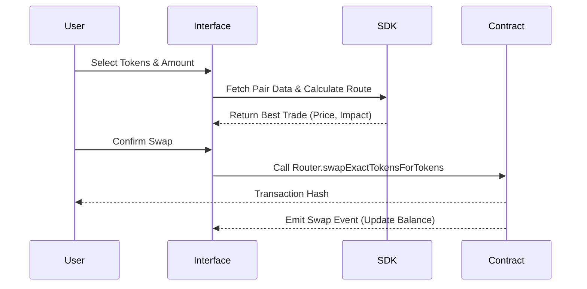
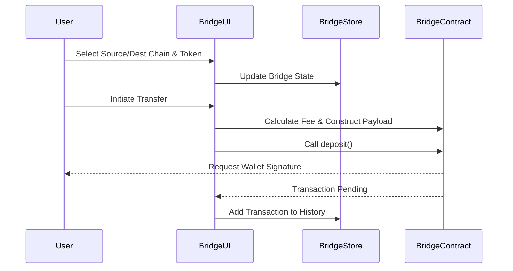

# W Swap Interface

W Swap is a multi-chain decentralized exchange (DEX) interface deployed on **W Chain**, **Binance Smart Chain (BSC)**, and **Ethereum**. It enables users to swap tokens, provide liquidity, and bridge assets between supported networks.

This repository contains the frontend application (`uniswap-2-interface`) and the custom SDK (`v2-sdk`) tailored for the W Chain ecosystem.

## 📚 Overview

The W Swap interface is built with **React** and uses a modified version of the **Uniswap V2 SDK**. It interacts with smart contracts on multiple blockchains to facilitate decentralized trading and asset bridging.

### Key Features
- **Swap**: Instant token exchange using Automated Market Maker (AMM) protocols.
- **Pool**: Liquidity management (Add/Remove liquidity) to earn trading fees.
- **Bridge**: Cross-chain asset transfer between W Chain, BSC, and Ethereum.

## 🏗 Architecture

The application follows a modular architecture where the UI interacts with the blockchain through a combination of the SDK (for logic/calculations) and direct contract calls (for execution).

```mermaid
graph TD
    User[User] --> UI[React UI]
    UI --> Redux[Redux Store]
    UI --> Hooks[Custom Hooks]
    
    subgraph "Core Logic"
        Hooks --> SDK[W Swap SDK (v2-sdk)]
        SDK --> Pricing[Pricing & Routing]
        SDK --> Entities[Token/Pair Entities]
    end
    
    subgraph "Blockchain Interaction"
        Hooks --> Web3[Web3 Provider (ethers.js)]
        Web3 --> WChain[W Chain (171717)]
        Web3 --> BSC[BSC (56)]
        Web3 --> Eth[Ethereum (1)]
    end
    
    Redux --> UI
```

### 🔄 Swap Flow
The swap functionality relies heavily on the SDK to calculate the best trade routes and pricing before executing the transaction on-chain.



### 🌉 Bridge Flow
The Bridge feature is a self-contained module within the app (`src/pages/Bridge`) that handles cross-chain locking and minting/releasing of assets.



## 🛠 Tech Stack & Dependencies

- **Frontend Framework**: React
- **State Management**: Redux Toolkit (Global State), Redux LocalStorage Simple (Persistence)
- **Blockchain Interaction**:
    - `web3-react`: Wallet connection and provider management.
    - `ethers.js`: Contract interaction.
    - `@uniswap/sdk` (Modified): Core logic for pricing, pairs, and routing.
- **Styling**: Styled Components

### Directory Structure

| Path | Description |
|------|-------------|
| `uniswap-2-interface/` | Main React application. |
| `uniswap-2-interface/src/pages/` | Feature entry points (Swap, Pool, Bridge). |
| `uniswap-2-interface/src/state/` | Redux slices for App, User, Transactions. |
| `v2-sdk/` | Custom SDK fork with W Chain logic. |

## 🚀 Quick Start

### Prerequisites
- **Node.js**: v18.x
- **Yarn**: v1.x

### Installation & Build

The project consists of two parts: the SDK and the Interface. You must build the SDK first as the interface depends on it.

```bash
# 1. Install dependencies
yarn

# 2. Build the SDK
yarn build:sdk

# 3. Build the Interface
yarn build:interface
```

### Local Development

To start the development server:

```bash
cd uniswap-2-interface
yarn start
```
The app will be available at `http://localhost:3000`.

## 📖 Documentation

For more detailed technical documentation, please refer to:
- [**Features Deep Dive**](docs/features.md): Detailed breakdown of Swap, Pool, and Bridge implementations.
- [**SDK Modifications**](docs/sdk.md): Specific changes made to the Uniswap V2 SDK for W Chain compatibility.

## 🔗 Contract Addresses

| Network | Chain ID | Factory | Router |
|---------|----------|---------|--------|
| **W Chain** | 171717 | `0x...` | `0x...` |
| **BSC** | 56 | `0x...` | `0x...` |
| **Ethereum** | 1 | `0x...` | `0x...` |

*> Note: Check `v2-sdk/src/constants.ts` for the most up-to-date addresses.*
